# Blogging Platform (Next.js + Strapi)

A modern, full-stack blogging platform built with **Next.js** for the frontend and **Strapi CMS** for the backend.

## Tech Stack

### Frontend

- **Framework**: [Next.js 16](https://nextjs.org/) (React 19)
- **Styling**: [Tailwind CSS](https://tailwindcss.com/)
- **Animations**: [Framer Motion](https://www.framer.com/motion/)

### Backend

- **CMS**: [Strapi 5](https://strapi.io/) (Headless CMS)
- **Database**: PostgreSQL (Production) / SQLite (Development)
- **Storage**: Cloudinary (for media optimization)
- **Hosting**: Render (Backend) / Vercel (Frontend)

---

## Architecture & Data Flow (DFD)

### 1. Full System Integration

This diagram shows how the User, Frontend, Backend, and Database interact.

```mermaid
graph LR
    subgraph "Users"
        Admin[👤 Admin/Author]
        Visitor[👤 Website Visitor]
    end

    subgraph "Next.js Frontend"
        Pages[Pages & Components]
        APIClient[API Client<br/>lib/api.ts]
        Forms[Forms<br/>Contact/Newsletter]
    end

    subgraph "Strapi Backend"
        AdminPanel[Admin Panel]
        RESTAPI[REST API]

        subgraph "Content"
            Posts[Blog Posts]
            Cats[Categories]
            Tags[Tags]
            Msgs[Messages]
            Subs[Subscribers]
        end

        Database[(Database)]
    end

    subgraph "External Services"
        ConvertKit[ConvertKit<br/>Newsletter Service]
        Cloudinary[Cloudinary<br/>Media Storage]
    end

    Admin -->|Creates Content| AdminPanel
    AdminPanel --> Posts
    AdminPanel --> Cloudinary

    Visitor -->|Visits Website| Pages
    Pages -->|Fetches Data| APIClient
    APIClient -->|HTTP GET| RESTAPI

    RESTAPI -->|JSON Response| APIClient
    APIClient -->|Displays| Pages

    Forms -->|Submit Data| RESTAPI
    RESTAPI -->|Stores| Msgs
    RESTAPI -->|Stores| Subs

    Forms -.Optional.-> ConvertKit

    Posts --> Database
    Msgs --> Database
    Subs --> Database
```



### 2. Strapi Backend Architecture


### 3. Workflow Diagram


---

## Project Structure

```text
blogging/
├── nextblog/                # Next.js Frontend
│   ├── app/                 # App Router (Pages)
│   ├── components/          # Reusable UI Components
│   ├── lib/                 # API Utilities
│   ├── public/              # Static Assets
│   └── next.config.ts       # Next.js Config (Turbopack, Security)
└── strapiblog/              # Strapi Backend
    ├── config/              # Server, DB, Admin Config
    ├── src/api/             # Content Types & Controllers
    └── public/uploads/      # Local uploads (if not using Cloudinary)
```

---

## Getting Started

### Prerequisites

- Node.js (v18 or higher)
- npm

### 1. Setup Backend (Strapi)

```bash
cd strapiblog
npm install
npm run develop
```

_The admin panel will be available at `http://localhost:1337/admin`._

### 2. Setup Frontend (Next.js)

```bash
cd nextblog
npm install
npm run dev
```

_The site will be available at `http://localhost:3000`._

### 3. Environment Variables

You need to configure `.env` files for both projects.

**Frontend (`nextblog/.env.local`)**:

```bash
# Local Development
NEXT_PUBLIC_STRAPI_URL=http://localhost:1337

# Production (Vercel)
# NEXT_PUBLIC_STRAPI_URL=https://<your-app>.onrender.com
```

**Backend (`strapiblog/.env`)**:

```bash
HOST=0.0.0.0
PORT=1337
APP_KEYS=...
API_TOKEN_SALT=...
ADMIN_JWT_SECRET=...
TRANSFER_TOKEN_SALT=...
# Database settings (SQLite default/Postgres for Prod)
```

---

## Deployment

### Backend (Render)

1.  Connect your repo to Render.
2.  Set Build Command: `npm install && npm run build`
3.  Set Start Command: `npm run start`
4.  **Environment Variables**:
    - `DATABASE_CLIENT`: `postgres`
    - `DATABASE_URL`: (Internal Postgres URL)
    - `PUBLIC_URL`: `https://<your-app-name>.onrender.com` (CRITICAL for Admin Panel to work)

### Frontend (Vercel)

1.  Import `nextblog` folder to Vercel.
2.  **Environment Variables**:
    - `NEXT_PUBLIC_STRAPI_URL`: `https://<your-app-name>.onrender.com`
3.  Deploy!
