# Blogging Website – Next.js & Strapi CMS

## Overview

This project is a full-featured blogging platform built with **Next.js** (frontend) and **Strapi CMS** (backend). It supports dynamic content management, user authentication, categories, tags, newsletter subscriptions, and more.

---

## Tech Stack

- **Frontend:** Next.js 16, React 19, Tailwind CSS, Framer Motion
- **Backend:** Strapi 5, Node.js 20+
- **Database:** SQLite (default, configurable)
- **Styling:** Tailwind CSS, PostCSS
- **Markdown Support:** react-markdown, rehype-raw, rehype-sanitize, remark-gfm
- **Authentication:** Strapi Users & Permissions plugin

---

## Architecture Diagrams

### Strapi Backend Architecture


### Next.js Frontend Architecture

```mermaid
graph TB
    subgraph "Next.js Frontend (Port 3000)"
        subgraph "Pages & Routes"
            Home[Home Page<br/>/]
            Blog[Blog Listing<br/>/blog]
            BlogPost[Blog Post Detail<br/>/blog/[slug]]
            Categories[Categories Page<br/>/categories]
            CategoryPage[Category Posts<br/>/category/[slug]]
            TagPage[Tag Posts<br/>/tag/[slug]]
            About[About Page<br/>/about]
            Contact[Contact Page<br/>/contact]
        end

        subgraph "Components"
            Hero[Hero Section]
            Featured[Featured Post]
            Recent[Recent Posts]
            CategoryBrowse[Category Browser]
            Newsletter[Newsletter Form]
            PostCard[Post Card]
            Header[Header/Nav]
            Footer[Footer]
        end

        subgraph "API Integration"
            APILib[API Library<br/>lib/api.ts]
            APIRoute[API Routes<br/>app/api/*]
        end

        subgraph "Styling"
            Tailwind[Tailwind CSS]
            Framer[Framer Motion<br/>Animations]
            Markdown[Markdown Renderer<br/>react-markdown]
        end

        Home --> Hero
        Home --> Featured
        Home --> Recent
        Home --> CategoryBrowse
        Home --> Newsletter

        Blog --> PostCard
        BlogPost --> Markdown
        Categories --> CategoryBrowse
        Contact --> Newsletter

        Hero --> APILib
        Featured --> APILib
        Recent --> APILib
        CategoryBrowse --> APILib
        Blog --> APILib
        BlogPost --> APILib
        CategoryPage --> APILib
        TagPage --> APILib
        Contact --> APIRoute

        APILib -.uses.-> Tailwind
        Components -.styled with.-> Tailwind
        Components -.animated with.-> Framer
    end

    style Home fill:#667eea,stroke:#333,stroke-width:2px,color:#fff
    style APILib fill:#48bb78,stroke:#333,stroke-width:2px,color:#fff
    style Tailwind fill:#38b2ac,stroke:#333,stroke-width:2px,color:#fff
```

### Full System Integration

```mermaid
graph LR
    subgraph "Users"
        Admin[👤 Admin/Author]
        Visitor[👤 Website Visitor]
    end

    subgraph "Next.js Frontend (localhost:3000)"
        Pages[Pages & Components]
        APIClient[API Client<br/>lib/api.ts]
        Forms[Forms<br/>Contact/Newsletter]
    end

    subgraph "Strapi Backend (localhost:1337)"
        AdminPanel[Admin Panel]
        RESTAPI[REST API]

        subgraph "Content"
            Posts[Blog Posts]
            Cats[Categories]
            Tags[Tags]
            Msgs[Messages]
            Subs[Subscribers]
        end

        Database[(SQLite DB)]
    end

    subgraph "External Services"
        ConvertKit[ConvertKit<br/>Newsletter Service]
    end

    Admin -->|Creates/Edits Content| AdminPanel
    AdminPanel --> Posts
    AdminPanel --> Cats
    AdminPanel --> Tags

    Posts --> Database
    Cats --> Database
    Tags --> Database
    Msgs --> Database
    Subs --> Database

    Visitor -->|Visits Website| Pages
    Pages -->|Fetches Data| APIClient
    APIClient -->|HTTP GET Requests| RESTAPI

    RESTAPI -->|Returns JSON| APIClient
    APIClient -->|Displays Content| Pages

    Forms -->|Submit Data| RESTAPI
    RESTAPI -->|Stores| Msgs
    RESTAPI -->|Stores| Subs

    Forms -.Optional.-> ConvertKit

    RESTAPI --> Posts
    RESTAPI --> Cats
    RESTAPI --> Tags

    style Admin fill:#667eea,stroke:#333,stroke-width:2px,color:#fff
    style Visitor fill:#48bb78,stroke:#333,stroke-width:2px,color:#fff
    style RESTAPI fill:#ed8936,stroke:#333,stroke-width:2px,color:#fff
    style Database fill:#f6ad55,stroke:#333,stroke-width:2px,color:#fff
```



**Key Integration Points:**

1. **Data Flow (Read):**

   - Next.js pages call functions in `lib/api.ts`
   - API client makes HTTP GET requests to Strapi endpoints
   - Strapi returns JSON data with populated relations
   - Next.js renders the data using React components

2. **Data Flow (Write):**

   - User submits forms (contact/newsletter)
   - Next.js sends HTTP POST requests to Strapi
   - Strapi validates and stores data in SQLite database
   - Response sent back to Next.js for user feedback

3. **Content Management:**

   - Admins use Strapi Admin Panel (localhost:1337/admin)
   - Create/edit blog posts, categories, tags
   - Upload images and media files
   - Changes immediately available via API

4. **Authentication:**
   - Strapi Users & Permissions plugin handles auth
   - JWT tokens for API authentication
   - Role-based access control (Public, Authenticated, Admin)

---

## Folder Structure

## File Structure

```text
blogging/
├── nextblog/                # Next.js frontend
│   ├── app/                 # Main pages (blog, about, contact, etc.)
│   │   ├── blog/            # Blog listing & dynamic [slug]
│   │   ├── categories/      # Categories listing
│   │   ├── category/        # Dynamic category [slug]
│   │   ├── tag/             # Dynamic tag [slug]
│   │   ├── about/           # About page
│   │   ├── contact/         # Contact page
│   │   └── api/             # API routes (newsletter)
│   ├── components/          # Reusable React components
│   ├── lib/                 # API utilities
│   ├── public/              # Static assets
│   ├── tsconfig.json        # TypeScript config
│   └── ...                  # Other config files
├── strapiblog/              # Strapi backend
│   ├── config/              # Strapi config (admin, api, db, plugins, server)
│   ├── database/            # Migrations, uploads
│   ├── src/
│   │   ├── api/             # Content types, controllers, routes, services
│   │   │   ├── blog-post/   # Blog post API
│   │   │   ├── category/    # Category API
│   │   │   ├── tag/         # Tag API
│   │   │   ├── contact-message/ # Contact API
│   │   │   └── subscriber/  # Newsletter API
│   │   └── extensions/      # Users-permissions extension
│   ├── public/              # Static files (robots.txt, uploads)
│   ├── package.json         # Strapi dependencies
│   └── ...                  # Other config files
├── readme.md                # Project documentation
└── ...                      # Other files
```

---

## Workflow Diagram


---

---

## Workflow & Connections

1. **Content Management:**
   - Authors create/edit blog posts, categories, tags, and manage subscribers in Strapi admin panel.
2. **API Connection:**
   - Next.js frontend fetches content from Strapi via REST API endpoints (see `nextblog/lib/api.ts`).
3. **Dynamic Routing:**
   - Blog posts, categories, and tags use dynamic routes (e.g., `/blog/[slug]`, `/category/[slug]`).
4. **Newsletter & Contact:**
   - Users can subscribe to newsletters and send contact messages, stored in Strapi.
5. **Authentication:**
   - User registration and login handled via Strapi Users & Permissions plugin.

---

## Setup Instructions

### 1. Clone the Repository

```bash
git clone <repo-url>
cd blogging
```

### 2. Install Dependencies

#### Strapi Backend

```bash
cd strapiblog
npm install
```

#### Next.js Frontend

```bash
cd ../nextblog
npm install
```

### 3. Run Development Servers

#### Strapi (Backend)

```bash
cd ../strapiblog
npm run develop
```

#### Next.js (Frontend)

```bash
cd ../nextblog
npm run dev
```

### 4. Access the Apps

- **Strapi Admin Panel:** [http://localhost:1337/admin](http://localhost:1337/admin)
- **Next.js Frontend:** [http://localhost:3000](http://localhost:3000)

---

## Deployment

- Strapi can be deployed on Strapi Cloud, Heroku, DigitalOcean, etc. (see [Strapi deployment docs](https://docs.strapi.io/dev-docs/deployment)).
- Next.js can be deployed on Vercel, Netlify, or any Node.js hosting.

---

## API Endpoints (Strapi)

- `/api/blog-posts` – Blog posts
- `/api/categories` – Categories
- `/api/tags` – Tags
- `/api/contact-messages` – Contact form submissions
- `/api/subscribers` – Newsletter subscribers

---

## Customization & Extensibility

- Add new content types in Strapi (`src/api/`)
- Extend frontend pages/components in Next.js
- Configure authentication, roles, and permissions in Strapi

---

## License

See `strapiblog/license.txt` for license details.

---

## Credits

- Built with [Next.js](https://nextjs.org/) & [Strapi](https://strapi.io/)
- Starter templates and plugins as listed in respective `package.json` files

---

## Contact & Support

- For issues, open a GitHub issue or contact the maintainer.
